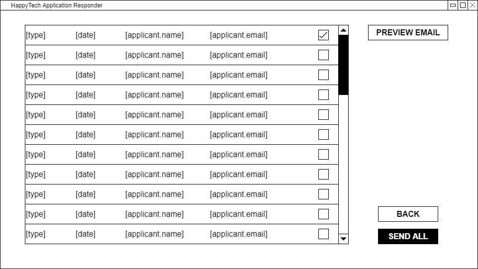

<h1 align="center">
  
  <br>
  HappyTech Recruitment Feedback Tool
</h1>

<p align="center">
  A recruitment feedback tool that assists recruiters and hiring managers to respond to a large group of candidates with curated messages that are automatically emailed.
</p>

<br>

<details><summary><b>Contents</b></summary>
  <ul>
    <li><a href="#aims">Project Aims</a></li>
    <li><a href="#plan">Project Plan</a></li>
    <li><a href="#features">Features</a></li>
    <li><a href="#screenshots">Screenshots</a></li>
    <li><a href="#install">How to Install</a></li>
    <li><a href="#tutorial">How to Use</a></li>
    <li><a href="#diagrams">Project Diagrams & User Stories</a></li>
    <li><a href="#wireframes">Wireframes</a></li>
    <li><a href="#team">Team</a></li>
  </ul>
</details>

<br>

<h2 id="aims" align="center">
  Project Aims
</h2>

This project was the result of coursework from our Software Engineering module in the second year of our Computer Science degree and focused on using agile software development, remotely working in a team, and using Git & GitHub.

The project aims to create a software application for HappyTech that allows an employee to quickly generate feedback for an applicant in a specific format based on their type of application (i.e., CV or interview). The feedback should automatically generate when a code is selected so that the recruiter does not need to type a lot. After this, the feedback should be emailed to the applicant.

<br>

<h2 id="plan" align="center">
  Project Plan
</h2>

The software application is created following the Software Lifecycle. This means the process acts according to the Agile methodology to allow an active collaboration with team members and adapt to new system requirements.

The first development process is the analysis, where user stories play an essential role. Being part of the Agile approach, they are composed of a sentence that expresses a scenario where the desired functionality is required. In the proposed case study, the main functionality is expressed in 14 user stories.

The next development process is software design. Accordingly, the application is designed using three UML Diagrams:

<table align="center">
  <tr>
    <th>Use Case Diagram</th>
    <td>A behavioural diagram that summarises the user actions</th>
  </tr>
  <tr>
    <th>Class Diagram</td>
    <td>A structured diagram that describes the class attributes and operations</td>
  </tr>
  <tr>
    <th>Sequence Diagram</td>
    <td>An interaction diagram that describes how and in what order a group of objects work together in a system</td>
  </tr>
</table>

To accommodate user requirements, a database is implemented to store data that needs to persist beyond the point of program termination. The EERD is used to visually represent the database structure and its relationships with entities.

The application is developed in C# using the Visual Studio IDE. Git Version Control is used to make pair-programming possible.

Manually testing small novel applications by hand proves more adaptable to change and are less expensive compared to automated testing.

<br>

<h2 id="features" align="center">
  Features
</h2>

- Account login and registration system
- Dashboard for adding new applicants to the feedback pipeline
- Template editor
  - Create, edit, and delete templates, sections, and codes
- Code-to-paragraph feedback
  - Selecting a code will enter the associated paragraph, speeding up repetitive responses.
- Option to preview feedback to make sure it's correct
- Mass send feedback to applicants
- Database storing accounts, templates, sections, lists, feedback, and more

<br>

<h2 id="screenshots" align="center">
  Screenshots
</h2>

<div align="center">
  
  <br>
  
  <br>
  
  <br>
  
  <br>
  
  <br>
  
  <br>
  
  <br>
  
  <br>
  
  <br>
  
</div>

<br>

<h2 id="install" align="center">
  How to Install
</h2>

1. Clone the repository via GitHub or Git
```bash
$ git clone https://github.com/BlackSun93/happyTech
```

2. Open the project in Visual Studio

3. Run the program. Alternatively, click `Build > Build Solution` to access the program from outside Visual Studio by locating the now-compiled executable at `happytech/bin/debug/happytech.exe`

<br>

<h2 id="tutorial" align="center">
  How to Use
</h2>

1. Open the application and log in or create an account.

2. If this is the first time, then you will need to set up a template with sections and codes. Head over to the editor by clicking `Editor` in the lower left corner.

3. Click `Edit Template`. Then proceed through each tab to add a new component to the template.

4. Once codes have been saved and added, return to the dashboard.

5. Enter the applicant's details and select a template to review them against. Click `Save` when ready.

6. If multiple applicants are going to be reviewed, click `Add` in the top right to repeat the previous step.

7. Once all applicants have been added, click `Begin`.

8. Proceed through each applicant by selecting the relevant codes for feedback. If needed, extra comments can be added in the comments field below.

9. If needed, applicant feedback can be previewed by checking the applicant from the list and clicking `Preview`.

10. When finished, click `Send All` to convert the feedback into PDF files. The file will then be opened to view.

11. Click the `Dashboard` button in the lower right, followed by selecting `Logout` and `Are you sure?` to leave the application.

<br>

<h2 id="diagrams" align="center">
  Project Diagrams & User Stories
</h2>

The design and behaviour stage involved the creation of several diagrams and user stories to understand how to build the program. Below are links to those documents:

<ul>
  <li><a href="HappyTech/Documentation/happytech_diagrams-eerd.png">Extended Entity Relationship Diagram</a></li>
  <li><a href="HappyTech/Documentation/happytech_diagrams-use-case.png">Use Case Diagrams</a></li>
  <li><a href="HappyTech/Documentation/happytech_diagrams-class.png">Class Diagram</a></li>
  <li><a href="HappyTech/Documentation/happytech_user-stories.pdf">User Stories</a></li>
  <li><a href="HappyTech/Documentation/Sequences">Sequence Diagrams</a></li>
</ul>

<br>

<h2 id="wireframes" align="center">
  Wireframes
</h2>

Before development of the software began, a wireframe was created to layout the structure of forms and components. The wireframes below can be compared with the screenshots of the final product above to see how the results transferred from plan to action.

<div align="center">
  
  <br>
  
  <br>
  
  <br>
  
  <br>
  
</div>

<br>

<h2 id="team" align="center">
  Team
</h2>

<table align="center">
  <tr align="center">
    <th></th>
    <th></th>
    <th></th>
  </tr>
  <tr align="center">
    <td><a href="https://github.com/BlackSun93">Kean</a></td>
    <td><a href="https://github.com/SimoneCampo-SC">Simone</a></td>
    <td><a href="https://github.com/omosborne">Oliver</a></td>
  </tr>
</table>
